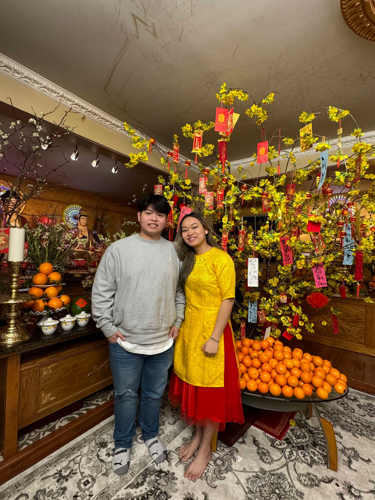

::: {.profile-hero}

  
  
Business Analytics Graduate | Data Analyst 📊

# 👋 Hi, I'm An Ly

I recently graduated with a Master’s degree in Applied Business Analytics from Boston University, with a foundation in Global Business and Entrepreneurship from Suffolk University.

I have developed strong analytical and problem-solving skills through hands-on experience with data analysis, modeling, and business intelligence tools.

I am particularly interested in applying analytics within finance, marketing, and emerging technology environments.

I am seeking opportunities where I can contribute to data-driven initiatives, apply my technical skills, and continue growing as a business analytics professional.

:::

---

## 🎯 What I’m Passionate About

📊 <strong>Data Analytics</strong> 
Applying analytics to solve business problems and improve decisions

🌐 <strong>Industry Impact</strong> 
Exploring how data improves efficiency and strategy across industries

🧠 <strong>Continuous Learning</strong> 
Growing through hands-on projects and real-world applications

---

## ✨ Outside of Academics

🧳 Traveling & exploring new environments

⚽ Following soccer & watching matches

🏀 Playing sports like soccer & basketball

🎙️ Listening to business & investing podcasts

🌱 Networking & community involvement

I’m always eager to learn, connect with like-minded individuals, and continuously grow both personally and professionally.

---

## 📸 Moments That Matter

::: {.carousel-container}

<button class="nav-btn left-btn">&#10094;</button>

::: {.carousel #carousel}

::: {.card}

Winter with friends ❄️

:::

::: {.card}

Hiking adventure 🏔️

:::

::: {.card}

Community volunteering 🤝

:::

::: {.card}

Tet celebration 🌸

:::

::: {.card}

Ski day ⛷️

:::

::: {.card}

Museum visit 🎨

:::

::: {.card}

Washington D.C. 🇺🇸

:::

::: {.card}

Fall hiking 🍂

:::

:::

<button class="nav-btn right-btn">&#10095;</button>

:::

<!-- MODAL -->

  &times;
  

---

## 🤝 Let’s Connect

<a href="cv.qmd" class="button btn-outline-primary">📄 View CV</a>  

<a href="experience.qmd" class="button btn-outline-primary">💼 View Experience</a>  

<a href="contact.html" class="button btn-outline-primary">📬 Contact Me</a>

