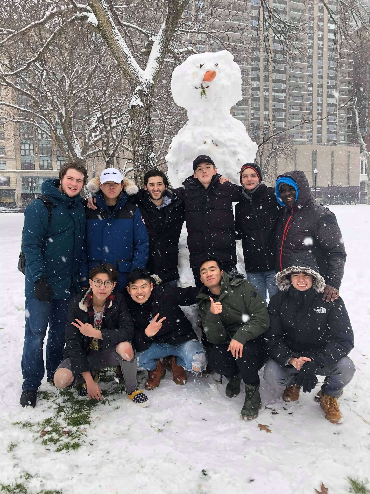
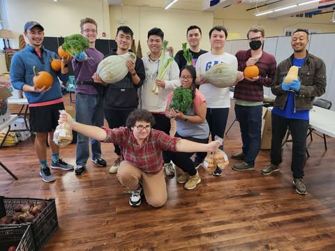
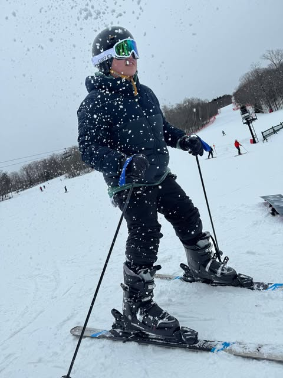
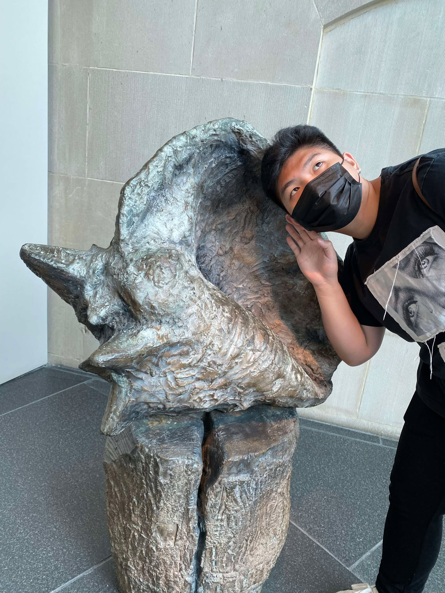
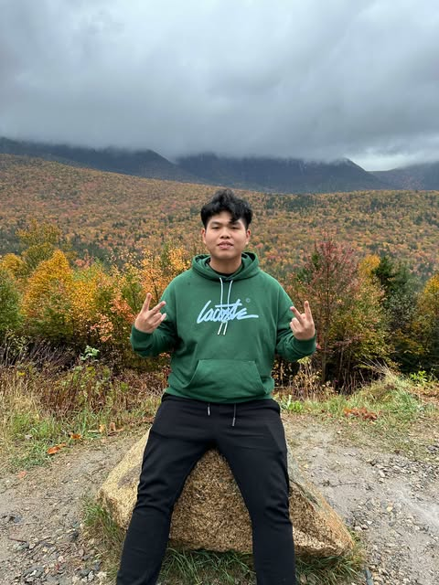

# 👋 Hi, I'm An Ly

  

I recently graduated with a Master’s degree in Applied Business Analytics from Boston University, with a foundation in Global Business and Entrepreneurship from Suffolk University. I have developed strong analytical and problem-solving skills through hands-on experience with data analysis, modeling, and business intelligence tools.

I am particularly interested in applying analytics within finance, marketing, and emerging technology environments. My focus is on translating complex data into clear, actionable insights that support strategic decision-making.

I am seeking opportunities where I can contribute to data-driven initiatives, apply my technical skills, and continue growing as a business analytics professional.

---

 

## 🎯 What I’m Passionate About

- 📊 Applying data analytics to solve business problems and optimize decision-making  
- 🌐 Exploring how data improves efficiency, performance, and strategy across industries  
- 🧠 Continuously learning through hands-on projects and real-world applications  

---

 

## ✨ Outside of Academics

Outside of working with data, you’ll probably find me:

- 🧳 Exploring new cultures and environments through travel and outdoor activities  
- ⚽ Keeping up with soccer and watching matches or highlights  
- 🏀 Playing sports like soccer and basketball  
- 🎙️ Listening to podcasts about business, investing, and global trends  
- 🌱 Participating in student organizations, networking events, and community activities  

I’m always eager to learn, connect with like-minded individuals, and continuously grow both personally and professionally.

---

 

## 📸 Moments That Matter

Here are some snapshots of the people and experiences that keep me inspired and grounded.

:::: grid-gallery
::: {style="margin-top:20px; display: grid; grid-template-columns: repeat(auto-fit, minmax(280px, 1fr)); gap: 16px;"}

  
  
  

:::
::::

---

 

## 🏞️ Life Beyond the Classroom

Whether I’m skiing in the winter, exploring art, or traveling to new places, I believe experiences outside the classroom shape who I am just as much as my academic journey.

:::: grid-gallery
::: {style="margin-top:20px; display: grid; grid-template-columns: repeat(auto-fit, minmax(280px, 1fr)); gap: 16px;"}

  
  
  

:::
::::

---

 

## 🤝 Let’s Connect

Interested in working together or learning more about my background?

<a href="cv.qmd" class="button btn-outline-primary">📄 View CV</a>  
<a href="experience.qmd" class="button btn-outline-primary">💼 View Experience</a>  
<a href="contact.qmd" class="button btn-primary">📬 Contact Me</a>  

